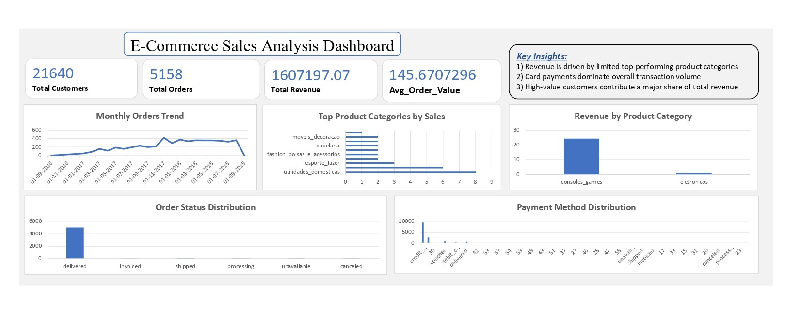

# E-Commerce SQL Analysis Dashboard

## Project Overview
This project analyzes e-commerce business performance using SQL queries and an Excel dashboard. It focuses on customers, orders, revenue trends, product performance, and payment insights.

---

## Business Problem
E-commerce companies generate large volumes of transactional data. Without proper analysis, it becomes difficult to track growth, identify trends, and support decision-making.

---

## Solution
Used MySQL to query e-commerce data and generate business insights. Built an Excel dashboard to present KPIs and trends in a clear and simple format.

---

## Key Insights
- Total customers, orders, and revenue analyzed  
- Monthly sales trends reviewed  
- Top customers and products identified  
- Revenue by category studied  
- Order status and payment method patterns examined  

---

## Dashboard Preview

---

## Files Included
- `Ecommerce_SQL_Analysis_Dashboard.xlsx` – Excel dashboard file  
- `Ecommerce_SQL_Analysis_Script.sql` – SQL queries used for analysis  
- `dashboard_preview.jpg` – Dashboard preview image  

---

## Tools Used
- MySQL  
- Excel  
- SQL  
- Data Analysis  

---

## Skills Demonstrated
- SQL Query Writing  
- KPI Reporting  
- Data Analysis  
- Dashboard Development  
- Business Insights  

---

## Purpose
This project demonstrates practical SQL, reporting, and dashboard skills relevant for Junior Data Analyst, MIS Executive, Reporting Analyst, Data Operations Analyst, and Operations Analyst roles.
